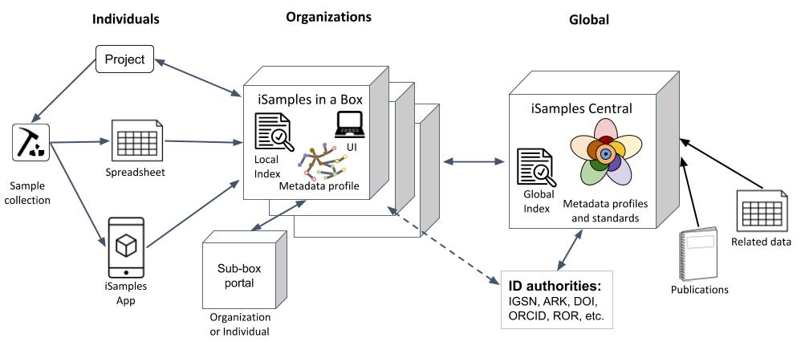
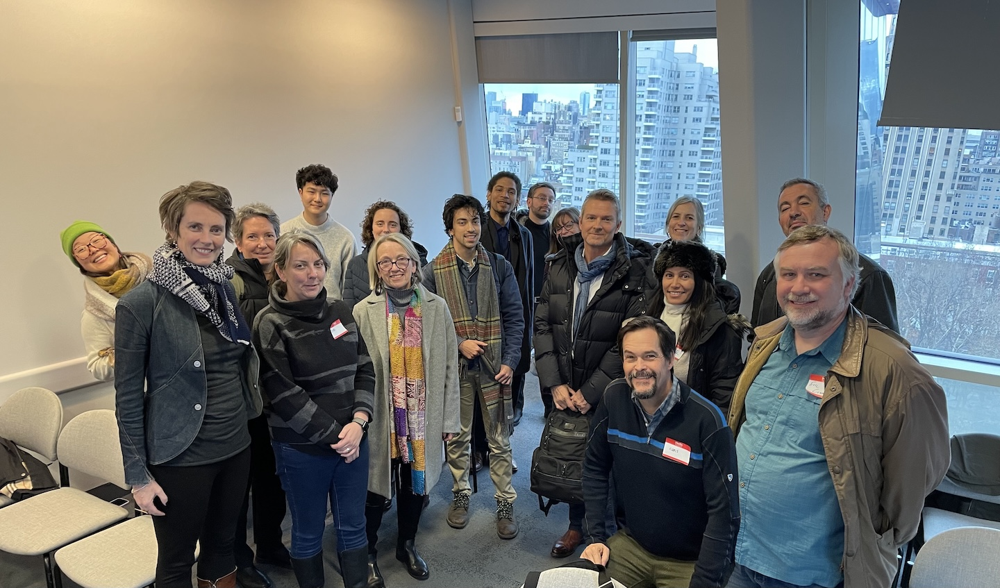
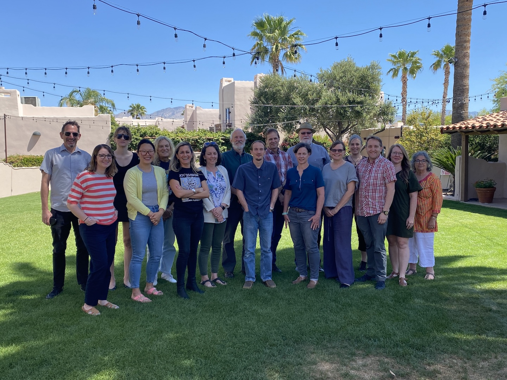
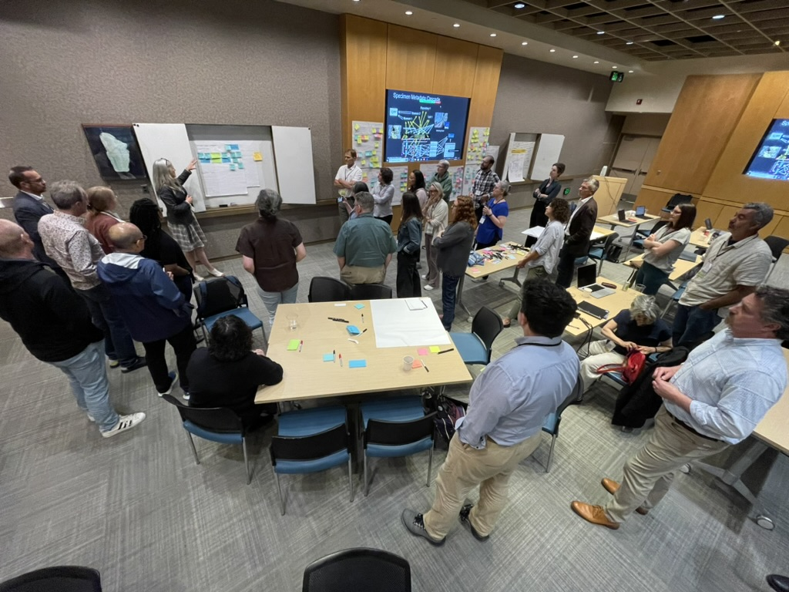
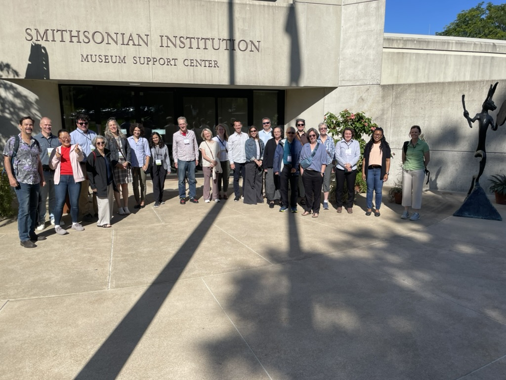
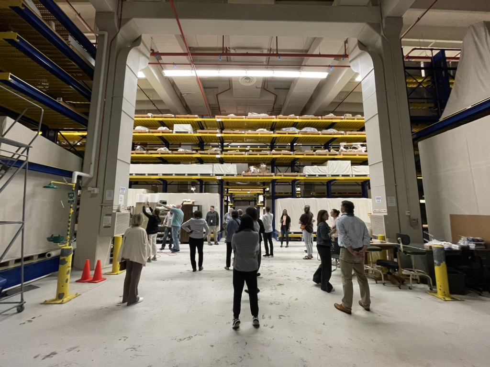
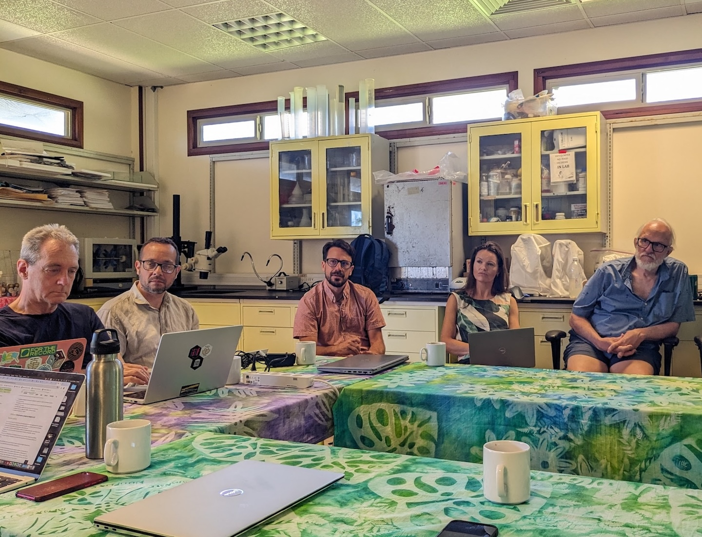

## Objectives {.unnumbered}

1. Design and develop iSamples infrastructure (iSamples in a Box and distributed data systems)
2. Build four initial implementations of iSamples for adoption and use case testing (Open Context, GEOME, SESAR, and Smithsonian Institution)
3. Conduct outreach and community engagement to developers, individual researchers, and international organizations concerned with material samples

::: {.callout-note collapse="true"}
### Technical Perspective

The iSamples project will:

* Create a flexible and scalable architecture to ensure broad adoption and implementation by diverse stakeholders.
* Build upon existing identifier infrastructure such as IGSNs (Global Sample Number) and ARKs (Archival Resource Keys), but is agnostic to identifier type.
* Encourage a high-level metadata standard for natural history samples (across biosciences, geosciences, and archaeology), while supporting community-developed metadata standards in specialist domains.
* Extend existing capabilities, enhance consistency, and expand their reach to serve science and society much more broadly through integration with established discipline-specific infrastructure at SESAR (geoscience), CyVerse (bioscience), Open Context (archaeology), and the Smithsonian Institution.

**Current data access**: The project now uses **geoparquet files + DuckDB-WASM** for efficient, browser-based data access and analysis. See the [Interactive Explorer](/explorer.html) for a live demo.

:::

## Team {.unnumbered}

### Principal Investigators {.unnumbered}

* [Kerstin Lehnert](https://orcid.org/0000-0001-7036-1977), Columbia University
* [Andrea Thomer](https://orcid.org/0000-0001-6238-3498), University of Arizona
* [Neil Davies](https://orcid.org/0000-0001-8085-5014), The Regents of the University of California, Berkeley
* [David Vieglais](https://orcid.org/0000-0002-6513-4996), University of Kansas Biodiversity Institute

::: {.callout-note collapse="true"}
### Contributors

:::: {.columns}
::: {.column width="34%"}
* Cao, Sean
* Choe, Saebyl
* Cui, Hong
* Davies, Neil (PI)
* Deck, John
* Kansa, Eric C
* Kansa, Sarah Whitcher
:::
::: {.column width="34%"}
* Kunze, John
* Lehnert, Kerstin (PI)
* Mandel, Danny
* Meyer, Christopher
* Ramdeen, Sarah
* Raia, Natalie
* Richard, Steve
:::
::: {.column width="32%"}
* Robinson, Erin
* Snyder, Rebecca
* Song, Lu-lin
* Thomer, Andrea (PI)
* Vieglais, Dave (PI)
* Walls, Ramona L
* Yee, Raymond
:::
::::
:::

## Photo Gallery {.unnumbered}

::: {layout-ncol=3}

{group="gallery"}

{group="gallery"}

{group="gallery"}

{group="gallery"}

{group="gallery"}

{group="gallery"}

:::

## Background & History {.unnumbered}

Research frequently uses material samples as a basic element for reference, study, and experimentation in many scientific disciplines, especially in the natural and environmental sciences, material sciences, agriculture, physical anthropology, archaeology, and biomedicine. Observations made on samples collected in the field and in the laboratory constitute a critical data resource for research that addresses grand challenges of our planet's future sustainability, from environmental change; to food, energy, and water resources; to natural hazards and their mitigation; to public health.

The large investments of public funds being made to curate huge volumes of samples acquired over decades or even centuries, and to collect and analyze new samples demand these samples to be openly accessible, easily discoverable, and documented with sufficient information to make them reusable.

The iSamples project is a multi-disciplinary collaboration that developed a national digital infrastructure providing services for globally unique, consistent, and convenient identification of material samples; metadata about them; and linking them to other samples, derived data, and research results published in the literature.

Leveraging significant national investments, iSamples provides the missing link among:

1. Physical collections (e.g., natural history museums, herbaria, biobanks)
2. Field stations, marine laboratories, long-term ecological research sites, and observatories
3. Data repositories and cyberinfrastructure

iSamples benefits national security and resource management by offering a means to assure sample provenance, improving scientific reproducibility and demonstrating compliance with ethical standards, national regulations, and international treaties.
