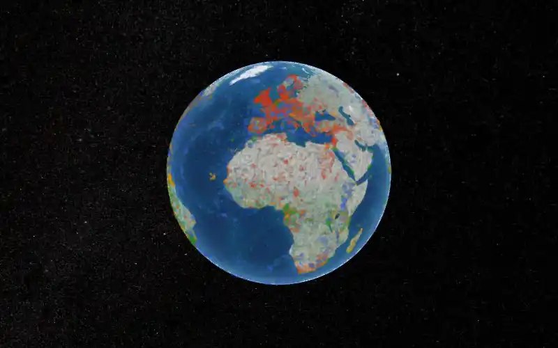
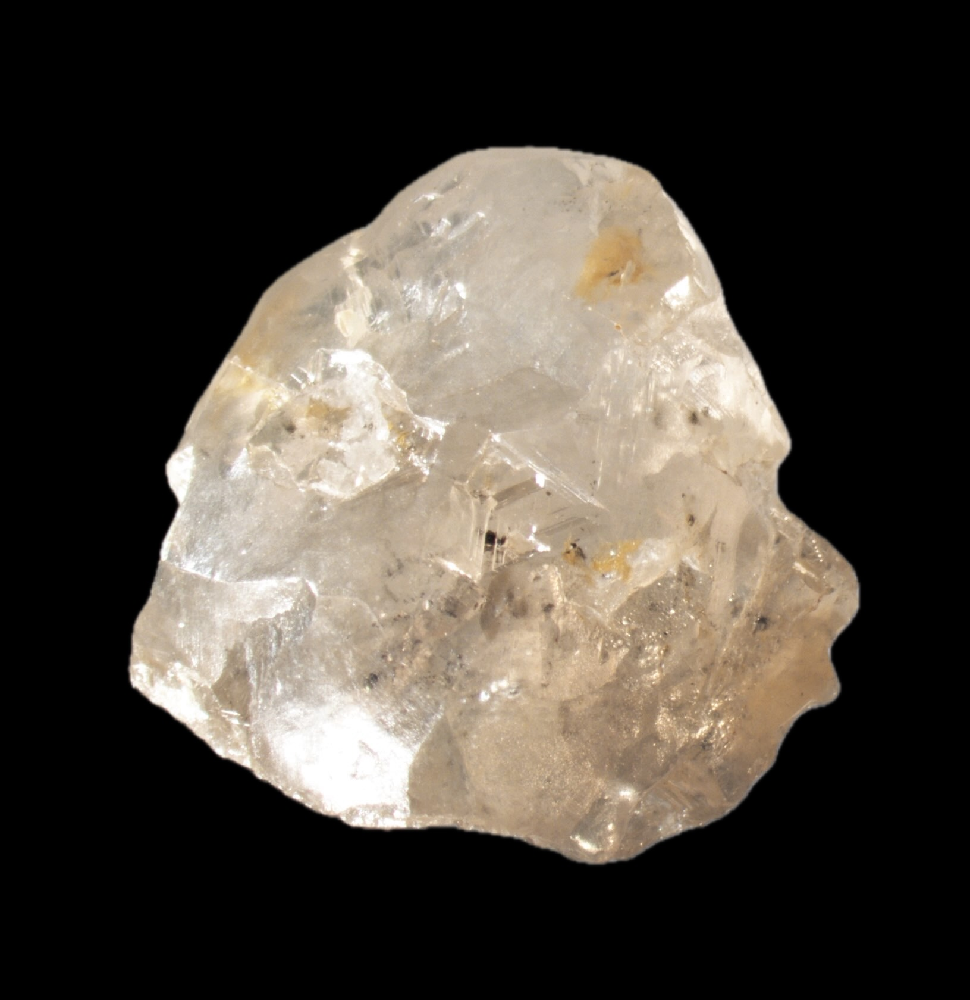
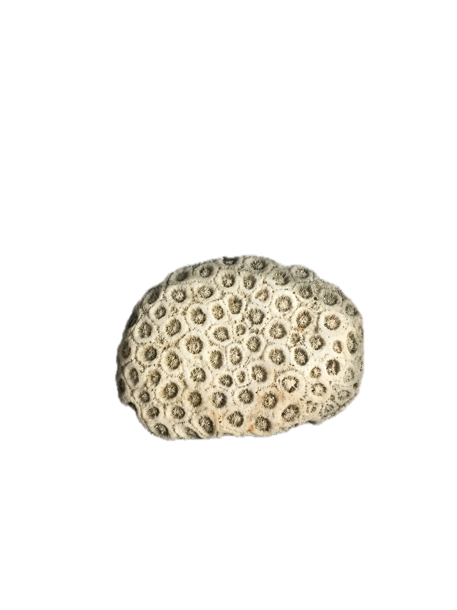
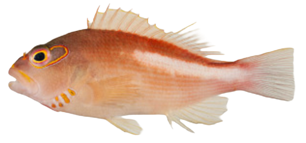
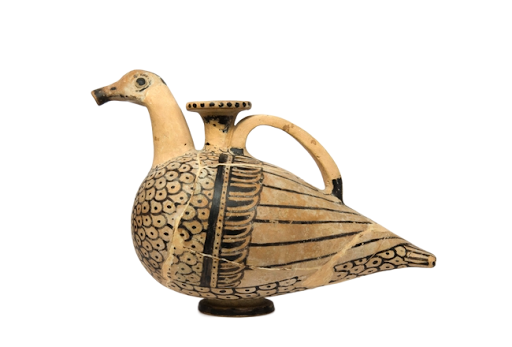
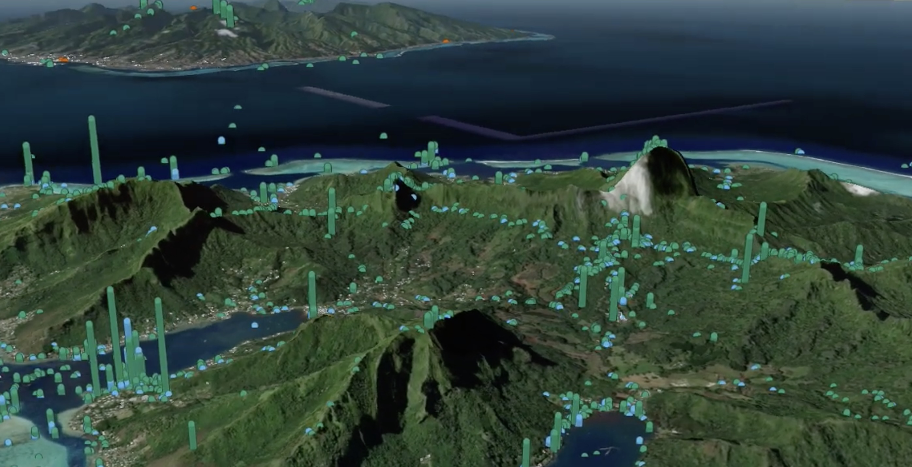

::: {.column-page}

[{fig-alt="Animated rotating globe showing iSamples data points from 4 scientific repositories" width="100%"}](/tutorials/progressive_globe.html "Explore the interactive globe")

:::

::: {.callout-note appearance="minimal"}
**6.7 million** physical samples | **4** repositories (SESAR, OpenContext, GEOME, Smithsonian) | **90+** countries | **Zero installation** — runs in your browser
:::

## Showcase: Real Samples from the Collection {.unnumbered}

::: {layout-ncol=4 layout-valign="center"}

[{group="showcase" fig-alt="Diamond sample"}](https://doi.org/10.58052/DIA0000YL "Diamond, collected 2019-06-11, Brazil")

[{group="showcase" fig-alt="Fossil coral sample"}](https://doi.org/10.58052/IEGIL000C "Fossil coral, from 10000 BCE, Cayman Islands")

[{group="showcase" fig-alt="Fish specimen"}](https://n2t.net/ark:65665/337856f1a655e4ad78b1ef10a16dfb6e3 "Paracirrhites arcatus, collected 2006-03-10, French Polynesia")

[{group="showcase" fig-alt="Red-figure askoi"}](https://n2t.net/ark:28722/r2p24/vdm_19600211 "Red-figure askoi, late-4th to early-3rd century BCE, Murlo, Italy")

:::

::: {.callout-tip collapse="true"}
## What is iSamples?

The Internet of Samples (iSamples) is a multi-disciplinary and multi-institutional project funded by the **National Science Foundation** to design, develop, and promote service infrastructure to uniquely, consistently, and conveniently identify material samples, record metadata about them, and persistently link them to other samples and derived digital content, including images, data, and publications.

iSamples integrates data from four major scientific repositories:

- **[SESAR](https://www.geosamples.org/)** — Earth science samples (rocks, minerals, sediments, soils)
- **[OpenContext](https://opencontext.org/)** — Archaeological and cultural heritage materials
- **[GEOME](https://geome-db.org/)** — Genomic and biological specimens
- **[Smithsonian](https://collections.nmnh.si.edu/)** — Natural history museum collections
:::

::: {.callout-tip collapse="true"}
## How can I access it?

The project uses **geoparquet files + DuckDB-WASM** for efficient, browser-based data access and analysis — no server required.

- **iSamples Full Dataset**: ~280 MB wide format, 6.7M samples
- **Available via**: Cloudflare R2 with HTTP range requests
- **Interactive tools**: [Progressive Globe](/tutorials/progressive_globe.html) for visual exploration, [Interactive Explorer](/tutorials/isamples_explorer.html) for search and filtering

All analysis happens in your browser. Only the data you need is downloaded — typically less than 1 MB for initial exploration.
:::

::: {.callout-tip collapse="true"}
## Why browser-based?

- **Universal access** — No installation, works in any modern browser
- **Fast analysis** — 5-10x faster than downloading full datasets
- **Memory efficient** — Analyze 300MB datasets using less than 100MB browser memory
- **Minimal transfer** — Only download the columns and rows you need
- **Reproducible** — Share a URL and anyone can see exactly what you see
:::

---

[{width="100%" group="showcase" fig-alt="iSamples data visualization from Moorea"}](https://youtu.be/JzNadmklzNs "Watch the iSamples data visualization video")
