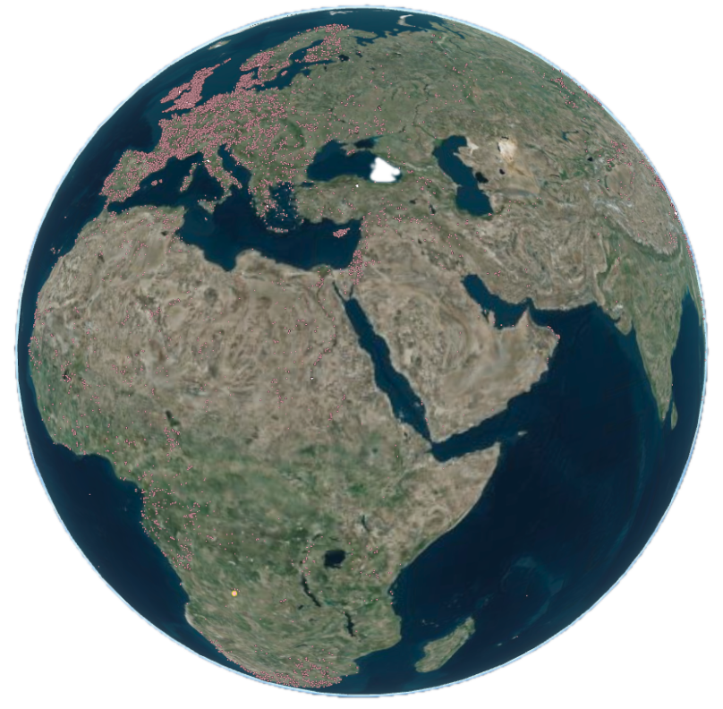

# Explore the Internet of Samples

::: {layout-ncol=4}

{group="my-group"}

{group="my-group"}

{group="my-group"}

{group="my-group"}

{group="my-group"}



:::

video link: 
https://youtu.be/JzNadmklzNs

ark_65665_337856f1a655e4ad78b1ef10a16dfb6e3.png
ark_28722_r2p24_vdm_19600211.png
IGSN_10.58052_DIA0000YL.png
IGSN_10.58052_IEGIL000C.png

The Internet of Samples (iSamples) is a multi-disciplinary and multi-institutional project funded by the National Science Foundation to design, develop, and promote service infrastructure to uniquely, consistently, and conveniently identify material samples, record metadata about them, and persistently link them to other samples and derived digital content, including images, data, and publications.

# Current Data Access: Geoparquet-Based Approach

**Note**: iSamples Central is currently unavailable. The project now uses **geoparquet files** for efficient, browser-based data access and analysis:

📊 &nbsp;&nbsp; **[Interactive Tutorials](/tutorials/)** - Modern browser-based analysis with DuckDB-WASM
 
🗺️ &nbsp;&nbsp; **Comprehensive Coverage** - Complete datasets from SESAR, OpenContext, GEOME, and Smithsonian
 
🚀 &nbsp;&nbsp; **High Performance** - Fast, efficient data access with minimal memory usage
 
🌐 &nbsp;&nbsp; **Universal Access** - Works in any modern browser without software installation

subtitle: "Toward an Interdisciplinary Cyberinfrastructure for Material Samples "
