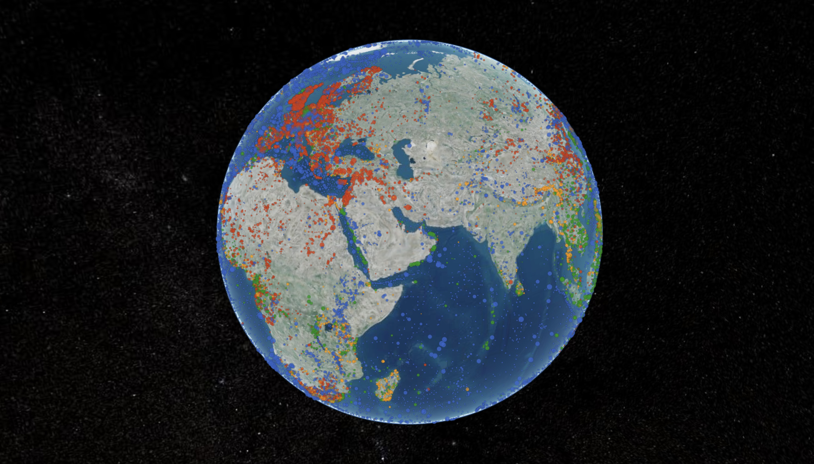

[{group="my-group"}](/explorer.html "interact with iSamples data (still a bit slow to load)")

::: {layout-ncol=4 layout-valign="center"}

[{width="7%"
group="my-group"}](https://doi.org/10.58052/DIA0000YL "Diamond, collected 2019-06-11, Brazil")

[{width="7%" group="my-group"}](https://doi.org/10.58052/IEGIL000C "Fossil coral, from 10000 BCE, Cayman Islands")

[{width="10%" group="my-group"}](https://n2t.net/ark:65665/337856f1a655e4ad78b1ef10a16dfb6e3 "Paracirrhites arcatus, collected 2006-03-10, French Polynesia")

[{width="10%"
group="my-group"}](https://n2t.net/ark:28722/r2p24/vdm_19600211 "Red-figure askoi, produced late-4th to early-3rd century BCE, Murlo, Italy")

:::

The Internet of Samples (iSamples) is a multi-disciplinary and multi-institutional project funded by the National Science Foundation to design, develop, and promote service infrastructure to uniquely, consistently, and conveniently identify material samples, record metadata about them, and persistently link them to other samples and derived digital content, including images, data, and publications.

[{width="100%" group="my-group"}](https://youtu.be/JzNadmklzNs "iSamples data visualization")

